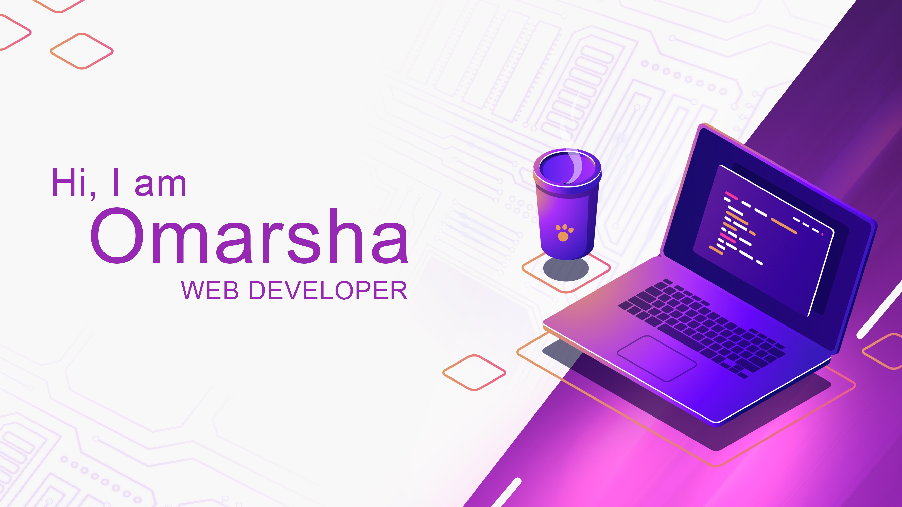

## 💎view my [portfolio](https://omarsha157.github.io/portfolio/)

👋 Hey I am omar, after my studies I did some freelancing as a graphic designer during that time I discovered the world of web development and to improve my skillset i am currently learning MEARN stack.

<!-- ## 📌 Pinned Repositories

 -->

## 📖Checkout my blog
- [How to code from your android smartphone](https://omarsha.hashnode.dev/how-to-code-from-your-android-smartphone)

## 📈 GitHub Stats

<!--  -->

	

<!--  -->

## Skills

 

 

<!---
omarsha157/omarsha157 is a ✨ special ✨ repository because its `README.md` (this file) appears on your GitHub profile.
You can click the Preview link to take a look at your changes.
--->
